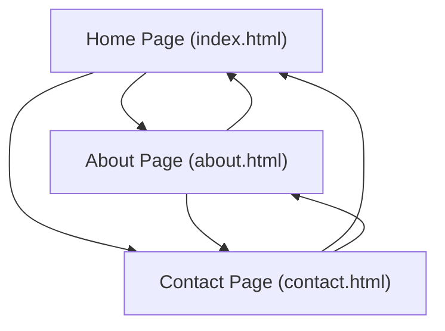

## 1. Product Overview
A simple, responsive HTML and CSS website for a generic Home Decoration Service ("LuxeDecor").
- Built to demonstrate a clean, beautiful web architecture with stunning CSS.
- Target value is to provide a visually striking foundation with working CSS, proper image paths, and a luxury interior design aesthetic.

## 2. Core Features

### 2.1 User Roles
Not applicable. Static informative website.

### 2.2 Feature Module
1. **Home page (`index.html`)**: Landing page introducing the service, featuring a stunning hero background image.
2. **About page (`about.html`)**: Information about the interior design team.
3. **Contact page (`contact.html`)**: A beautiful contact layout.

### 2.3 Page Details
| Page Name | Module Name | Feature description |
|-----------|-------------|---------------------|
| Home page | Main Content | Introduction, hero section with background, services showcase. |
| About page | Details | Text-based information and side-by-side image layout. |
| Contact page | Form/Info | Contact form layout with decorative background. |

## 3. Core Process
The user enters the site via the Home page and navigates through the main navigation menu to read About and Contact details.

## 4. User Interface Design
### 4.1 Design Style
- **Aesthetic**: Luxury, Refined, Minimalist.
- **Colors**: Soft beige (`#f5f5f0`), warm charcoal (`#2a2a2a`), and gold accents (`#d4af37`).
- **Typography**: 'Playfair Display' for elegant headings, 'Lato' for clean, readable body text.
- **Layout style**: Semantic HTML5, large immersive background images, card-based service sections, generous negative space.
- Fully responsive layout adapting to desktop, tablet, and mobile.

### 4.2 Page Design Overview
| Page Name | Module Name | UI Elements |
|-----------|-------------|-------------|
| All Pages | Header/Nav | Transparent-to-solid navigation, beautiful logo font. |
| Home Page | Hero | Full-screen background image, centered gold/white typography. |
| All Pages | Footer | Minimalist dark footer. |

### 4.3 Responsiveness
Desktop-first approach, easily adaptable to mobile via CSS media queries. Fluid containers and flexible typography.