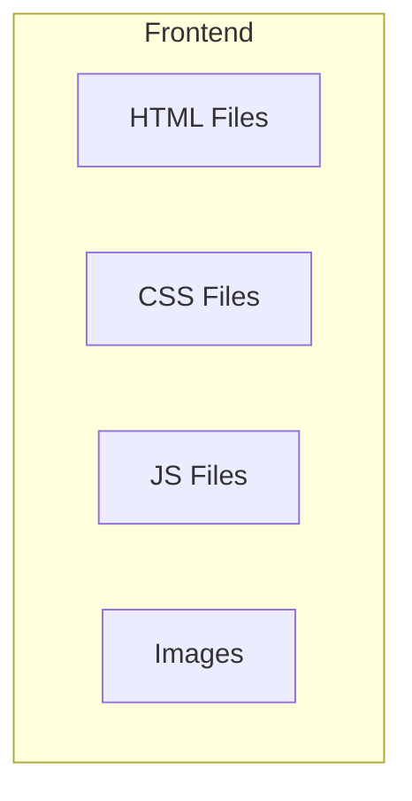

## 1. Architecture Design

## 2. Technology Description
- **Frontend**: Plain HTML5, CSS3, and Vanilla JavaScript. No frontend frameworks like React or Vue will be used as per user's strict constraints for a simple HTML/CSS website.
- **Directory Structure**: All files will be grouped inside a single folder `MyWebsite/` with standard subdirectories.
  - `MyWebsite/index.html`
  - `MyWebsite/about.html`
  - `MyWebsite/contact.html`
  - `MyWebsite/style.css`
  - `MyWebsite/css/`
  - `MyWebsite/js/`
  - `MyWebsite/images/`
- **Strict Guidelines Addressed**:
  1. Homepage is named exactly `index.html`.
  2. CSS linked via correct paths (e.g., `<link rel="stylesheet" href="style.css">` if in root, or `css/style.css` if inside css folder). We will keep `style.css` in root as requested by the initial structure `│── style.css`. Wait, the user explicitly provided: `│── style.css` and also `│── css/`. We will put it in `style.css` and use `<link rel="stylesheet" href="style.css">`.
  3. Image paths will be correct, e.g., ``.
  4. Links between pages will be relative, e.g., `<a href="about.html">About</a>`.

## 3. Route Definitions
| Route | Purpose |
|-------|---------|
| `/MyWebsite/index.html` | Home page |
| `/MyWebsite/about.html` | About page |
| `/MyWebsite/contact.html` | Contact page |

## 4. API Definitions
No API. Static content only.

## 5. Server Architecture Diagram
No backend server.

## 6. Data Model
Not applicable.
